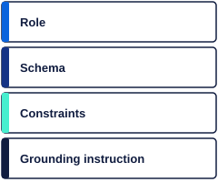

<!-- layout: title -->

Lab 1.1

<h1 class="slide-title">Tina answered three compliance questions this morning. All three were wrong in different ways.</h1>

<strong>Tina</strong> is Cortex Bank's AI compliance assistant. In this track you diagnose her failures and repair the system prompt that caused them.

  &#8592;
  <strong>Tip:</strong> Select <strong>Hide Instructions</strong> in the top bar to give the Brief full width.

---

<!-- layout: problem -->

  

User: What is Cortex Bank's CTR threshold?

Tina: The CTR threshold is $5,000 for cash
      transactions. A $9,500 deposit
      would be reportable.
  

  <h2 class="slide-heading">The problem</h2>
  
Tina answered confidently. The threshold is <strong>$10,000</strong> from policy-003. Cortex files reports on the wrong transactions if this ships.

  
This is one of three failures you will diagnose today.

---

<!-- layout: concept -->

   &nbsp;&nbsp;
   &nbsp;&nbsp;
  

  <h2 class="slide-heading">Three model types, three jobs</h2>
  
<strong>LLM</strong> generates text. <strong>Embedding model</strong> positions text in a vector space. <strong>Reranker</strong> scores and orders candidate documents. Each type has one job. Giving it the wrong job produces a distinct failure pattern.

---

<!-- layout: concept -->

  

User: What is the CTR threshold?

Response from embedding endpoint:
[0.023, -0.451, 0.887, 0.112,
 -0.334, 0.556, 0.091, ...]
(768 floats — not an answer)
  

  <h2 class="slide-heading">When the wrong model gets the job</h2>
  
Ask an embedding model to "answer" a question and it returns a vector. The UI may show nothing, or raw numbers. No error — just the wrong output type for the task.

---

<!-- layout: concept -->

  

Tina: The threshold is $5,000.
      A $9,500 deposit is reportable.

policy-003 (actual text):
"Currency Transaction Reports are
 required for cash transactions
 exceeding $10,000..."
  

  <h2 class="slide-heading">Hallucination is confident</h2>
  
The $5,000 answer has no signal that it is wrong. Same format, same confidence, wrong value. The only way to catch it is to compare against the authoritative source.

---

<!-- layout: concept -->

  

{
  "answer": "SAR filing deadline: 45 days",
  "policy_id": "policy-011",
  "confidence": "high"
}

policy-011 (actual):
"SARs must be filed within
 30 calendar days..."
  

  <h2 class="slide-heading">Schema-valid is not correct</h2>
  
The output has the right shape — JSON with all required fields. But the value is wrong: 45 days, not 30. Schema validation passes. Semantic validation catches it. This sets up track 1.2.

---

<!-- layout: concept -->

  

  <h2 class="slide-heading">Anatomy of a system prompt</h2>
  
A well-structured prompt has four regions: <strong>Role</strong> (who Tina is), <strong>Schema</strong> (required output format), <strong>Constraints</strong> (rules to follow), <strong>Grounding instruction</strong> (cite retrieved text). Remove any one and Tina's behavior changes.

---

<!-- layout: concept -->

  

# Ablation: remove each element, re-run 6 questions
# Record how many stay grounded.

Element removed    | Grounded
role               | ? / 6
schema             | ? / 6
constraints        | ? / 6
grounding          | ? / 6   ← your results will differ
  

  <h2 class="slide-heading">How you will prove a fix</h2>
  
The check runs your prompt against 6 held-out questions, then re-runs with each prompt element removed. The element whose removal drops the grounded count most is the decisive one. Your ablation results decide the Defend answer.

---

<!-- layout: rule -->
<!-- rule -->

<h2 class="slide-heading">Decision rule</h2>
<table class="rule-table">
  <tr><th>Prompt element removed</th><th>Grounded pass rate drops most</th><th>Therefore</th></tr>
  <tr>
    <td>Element A</td><td>&#x2193; biggest drop</td><td>Element A was decisive</td>
  </tr>
  <tr>
    <td>Element B</td><td>&#x2193; smaller drop</td><td>Element B was not decisive</td>
  </tr>
  <tr>
    <td>Element C or D</td><td>&#x2193; smallest drop</td><td>Those were not decisive</td>
  </tr>
</table>

Which element is "A" depends on which one your prompt was missing. Your ablation results answer it — not general knowledge.

---

<!-- layout: done -->

<h2 class="slide-heading" style="color:var(--white);">What done looks like</h2>

  

    3
    diagnoses recorded all endpoints invoked (Build 1)
  

  

    5/6
    grounded responses all 6 schema-valid (Build 2)
  

---

<!-- layout: next -->

<h2 class="slide-heading">Select Next, then open Build 1</h2>

Environment status:

  

  Provisioning — check back in a moment

