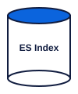

<!-- layout: title -->

Lab 1.2

<h1 class="slide-title">Tina's eligibility decisions validate. Some of them are wrong.</h1>

<strong>Tina</strong> is Cortex Bank's AI compliance assistant. Her decisions pass schema validation, but the compliance team found errors that the schema cannot catch. In this track you build a semantic validator and Tina's first retrieval pipeline.

---

<!-- layout: problem -->

  

Decision: {
  "subject": "Sandra Park",
  "threshold": 5000,
  "direction": "above",
  "reportable": false
}

JSON Schema: VALID
Policy-003:  threshold=10000, direction="at or above"
  

  <h2 class="slide-heading">The problem</h2>
  
The decision is schema-valid. Both values are wrong. The CTR threshold is <strong>$10,000</strong>, not $5,000. The direction is <strong>"at or above"</strong>, not "above". Cortex files the wrong reports.

---

<!-- layout: concept -->

  <table class="rule-table" style="font-size:15px;">
    <tr><th>A reasoning trace</th></tr>
    <tr><td>1. Retrieve policy-003 from index</td></tr>
    <tr><td>2. Parse threshold: $10,000</td></tr>
    <tr class="correct"><td>3. Compare: $9,500 above $10,000 → false ✗</td></tr>
    <tr><td>4. Set reportable: false</td></tr>
    <tr><td>5. Return decision JSON</td></tr>
  </table>

  <h2 class="slide-heading">A reasoning trace, step by step</h2>
  
Step 3 uses the wrong comparison operator. "Above" excludes the boundary. "At or above" includes it. The schema says nothing about which operator is correct.

---

<!-- layout: concept -->

  <table class="rule-table" style="font-size:14px;">
    <tr><th>JSON Schema can assert</th><th>JSON Schema cannot assert</th></tr>
    <tr><td>threshold is a number</td><td>threshold matches the policy value</td></tr>
    <tr><td>direction is a string</td><td>direction uses the correct operator</td></tr>
    <tr><td>reportable is a boolean</td><td>reportable follows from the facts</td></tr>
    <tr><td>all required fields present</td><td>against what source?</td></tr>
  </table>

  <h2 class="slide-heading">Schema checks shape; semantics check truth</h2>
  
Schema validation checks form, not facts. Semantic validity requires comparing the decision's claims against the authoritative source.

---

<!-- layout: concept -->

  
  
cortex-policies

  
19 policy documents + risk-scoring reference

  <h2 class="slide-heading">The source is in Elasticsearch</h2>
  
Retrieve the governing rule from <code>cortex-policies</code> using a semantic search on <code>body_semantic</code>. Compare the decision's threshold and direction against the retrieved text. That is semantic validation.

---

<!-- layout: concept -->

  

    

      
Index update

      
~1–3 s

      
Next query sees new value

    

    
PUT /cortex-policies/_doc/policy-003 → refresh → search

  

  <h2 class="slide-heading">What retrieval changes</h2>
  
Update the document in Elasticsearch. The next retrieval sees the new value within seconds. The model's weights are untouched. No retraining pipeline required.

---

<!-- layout: concept -->

  

    

      
Training run

      
Days +

      
Data pipeline + GPU time + eval

    

    
Collect data → train → evaluate → deploy

  

  <h2 class="slide-heading">What fine-tuning changes</h2>
  
Fine-tuning bakes updated knowledge into the model's weights. The data pipeline, training run, and evaluation cycle take days. Suitable when the update cadence is low and the propagation window is acceptable.

---

<!-- layout: concept -->

  <table class="rule-table" style="font-size:14px;">
    <tr><th>Cadence</th><th>Approach</th></tr>
    <tr class="correct"><td>Weekly updates</td><td>Retrieval — propagates in seconds</td></tr>
    <tr><td>Annual updates</td><td>Depends on your measured latency</td></tr>
  </table>
  
Propagation time is the deciding variable.

  <h2 class="slide-heading">Propagation time is the deciding variable</h2>
  
Your sandbox has a seeded change cadence. Measure how fast your pipeline propagates a policy update, then decide whether retrieval keeps pace. You will be given one cadence.

---

<!-- layout: concept -->

  

    

      1.
      Semantic search: <code>body_semantic</code>, k=3
    

    
↓

    

      2.
      Filter: <code>effective_date &lt;= now</code>
    

    
↓

    

      3.
      Inject top-3 context into prompt
    

    
↓

    

      4.
      LLM answers with source
    

  

  <h2 class="slide-heading">Building the pipeline</h2>
  
Four steps: semantic search, date filter, context injection, LLM call. You write the query in Build 2. The filter ensures Tina sees only current policy versions.

---

<!-- layout: rule -->
<!-- rule -->

<h2 class="slide-heading">Decision rule</h2>
<table class="rule-table">
  <tr><th>Cadence</th><th>Propagation latency</th><th>Approach</th></tr>
  <tr class="correct"><td>Weekly</td><td>Any</td><td>Retrieval</td></tr>
  <tr><td>Annual</td><td>Under 60 s</td><td>Retrieval</td></tr>
  <tr><td>Annual</td><td>Over 60 s</td><td>Fine-tuning + retrieval</td></tr>
</table>

Your Defend answers derive from your seeded cadence and your measured propagation latency.

---

<!-- layout: done -->

<h2 class="slide-heading" style="color:var(--white);">What done looks like</h2>

  

    3/3
    planted errors caught 0 false positives
  

  

    ≥0.80
    precision@3 on 5 held-out queries
  

  

    ✓
    updated threshold visible after PUT
  

---

<!-- layout: next -->

<h2 class="slide-heading">Select Next, then open Build 1</h2>

Environment status:

  

  Provisioning — check back in a moment

