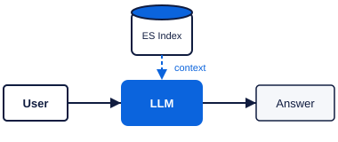
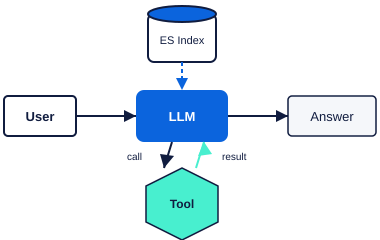
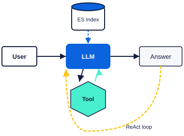

<!-- layout: title -->
<section class="slide" data-layout="title">
  
Lab 1.3

  <h1 class="slide-title">Four versions of Tina. Each one fails at exactly one thing.</h1>
  
Build Tina from a bare completion to a ReAct agent on Elasticsearch.

</section>

---

<!-- layout: problem -->
<section class="slide" data-layout="problem">
  

    

User: What is Cortex Bank's CTR threshold,
      and is a $9,500 cash deposit reportable?

Tina: The Currency Transaction Report (CTR)
      threshold is typically $5,000 for cash
      deposits. A $9,500 deposit would
      likely be reportable depending on
      your institution's policies.
    

  

  

    <h2 class="slide-heading">The problem</h2>
    
Tina answered confidently. She has no source. The threshold is <strong>$10,000</strong> from policy-003, and she gave the wrong number. Cortex files reports on the wrong transactions.

    
You will see this yourself in Build 1, stage 1.

  

</section>

---

<!-- layout: concept -->
<section class="slide" data-layout="concept">
  

    
  

  

    <h2 class="slide-heading">What a tier is</h2>
    
Four axes matter for Cortex: <strong>cost</strong> per 1,000 requests, <strong>latency</strong> p50, <strong>capability</strong> on the task, and <strong>deployment constraints</strong> such as data residency.

    
A benchmark on the wrong axis picks the wrong tier.

  

</section>

---

<!-- layout: concept -->
<section class="slide" data-layout="concept">
  

    
  

  

    <h2 class="slide-heading">Choose by constraint, not by benchmark</h2>
    
Cortex has three possible constraints: a <strong>data-residency</strong> rule that forbids one model region, a <strong>cost ceiling</strong> per 1,000 requests, and an <strong>accuracy floor</strong> on structured output.

    
Each constraint rules out a different tier. You will be given one. Measure both, then decide.

  

</section>

---

<!-- layout: concept -->
<section class="slide" data-layout="concept">
  

    
  

  

    <h2 class="slide-heading">Stage 1: bare completion</h2>
    
User &rarr; LLM &rarr; answer. No source consulted. The model generates from training data, which may be stale, wrong, or hallucinated.

    
Gap: <strong>no source</strong>.

  

</section>

---

<!-- layout: concept -->
<section class="slide" data-layout="concept">
  

    
  

  

    <h2 class="slide-heading">Stage 2: context injection</h2>
    
Retrieve the top-3 chunks from <code>cortex-policies</code> before the call. Inject them into the prompt. The model can now cite sources.

    
Gap: the model can only read what <strong>you pre-loaded</strong>. It cannot request different documents mid-answer.

  

</section>

---

<!-- layout: concept -->
<section class="slide" data-layout="concept">
  

    
  

  

    <h2 class="slide-heading">Stage 3: tool calling</h2>
    
Register <code>search_policies(query)</code> as a tool. The model calls it on demand. <code>finish_reason: tool_calls</code> triggers your dispatch; the result comes back as a <code>role: tool</code> message.

    
Gap: <strong>one shot</strong>. A two-hop question needs two searches; the model cannot yet loop.

  

</section>

---

<!-- layout: concept -->
<section class="slide" data-layout="concept">
  

    
  

  

    <h2 class="slide-heading">Stage 4: ReAct loop</h2>
    
Handle <code>tool_calls</code>, append each tool result, continue until <code>finish_reason: stop</code>. The model can now reason, search again, and synthesize across multiple tool calls.

    
Gap: none for two-hop compliance questions. This is the target architecture.

  

</section>

---

<!-- layout: concept -->
<section class="slide" data-layout="concept">
  

    

# assistant message
{"role": "assistant",
 "tool_calls": [{
   "id": "call_abc",
   "type": "function",
   "function": {
     "name": "search_policies",
     "arguments": "{\"query\": \"CTR threshold cash deposit\"}"
 }}]}

# your code runs search_policies(query=...)
# then appends:
{"role": "tool",
 "tool_call_id": "call_abc",
 "content": "[{\"policy_id\": \"policy-003\", ...}]"}
    

  

  

    <h2 class="slide-heading">The tool-call protocol</h2>
    
Four messages: <strong>assistant</strong> with <code>tool_calls</code>, your code dispatches, a <strong>tool</strong> message with the result, then the model continues. You implement the dispatch loop.

  

</section>

---

<!-- layout: concept -->
<section class="slide" data-layout="concept">
  

    

# search_policies tool schema
{
  "name": "search_policies",
  "description": "Search Cortex Bank AML policies",
  "parameters": {
    "type": "object",
    "properties": {
      "query": {"type": "string"}
    },
    "required": ["query"]
  }
}

# Elasticsearch query it runs
{"query": {"semantic": {
  "field": "body_semantic",
  "query": "CTR threshold cash deposit"
}}}
    

  

  

    <h2 class="slide-heading">Your tool is a search</h2>
    
<code>search_policies(query)</code> runs a semantic search over <code>cortex-policies</code>. You write the schema and the dispatch. The harness in <code>/opt/ara/lib/tina/</code> handles the rest.

  

</section>

---

<!-- layout: concept -->
<section class="slide" data-layout="concept">
  

    <table class="rule-table" style="font-size:16px;">
      <tr><th>Stage</th><th>What it cannot do</th></tr>
      <tr><td>1: bare completion</td><td>No source consulted</td></tr>
      <tr><td>2: context injection</td><td>Cannot choose documents mid-answer</td></tr>
      <tr><td>3: tool calling</td><td>Cannot loop; one shot only</td></tr>
      <tr><td>4: ReAct loop</td><td>(target; no gap for this task)</td></tr>
    </table>
  

  

    <h2 class="slide-heading">What each stage cannot do</h2>
    
The Defend asks which gap applied at each stage. Your recorded trace confirms it.

  

</section>

---

<!-- layout: rule -->
<!-- rule -->
<section class="slide" data-layout="rule">
  <h2 class="slide-heading">Decision rule</h2>
  <table class="rule-table">
    <tr>
      <th>Tier selection</th>
      <th>Stage gap</th>
    </tr>
    <tr class="correct">
      <td>Satisfies constraint <em>and</em> accuracy floor</td>
      <td>Read from your trace; match the stage description</td>
    </tr>
    <tr>
      <td>Both satisfy: choose the one meeting the floor</td>
      <td>S1: no source &bull; S2: cannot re-query &bull; S3: one shot</td>
    </tr>
  </table>
  
Defend grades against your own measurements, not a fixed key.

</section>

---

<!-- layout: done -->
<section class="slide" data-layout="done">
  <h2 class="slide-heading" style="color:var(--white);">What done looks like</h2>
  

    

      5
      runs per tier (Build 1)
    

    

      2
      tool calls in stage 4 both gold values returned
    

    

      4
      stage traces grounded from stage 2
    

  

  
Build 1 measures tiers. Build 2 records all four stages. Defend uses both.

</section>

---

<!-- layout: next -->
<section class="slide" data-layout="next">
  <h2 class="slide-heading">Select Check, then open Build 1</h2>
  
Environment status:

  

    

    Provisioning — check back in a moment
  

</section>
