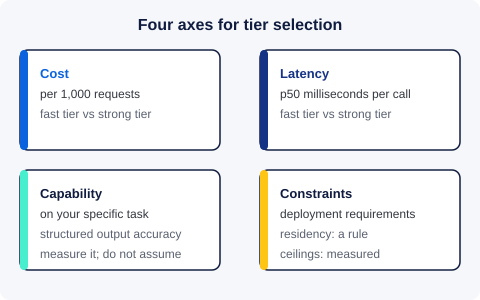
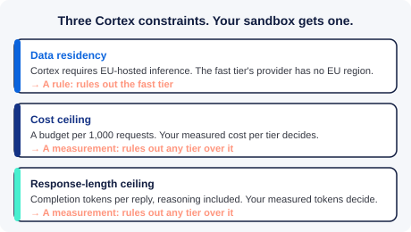
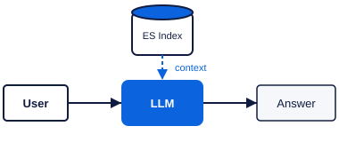
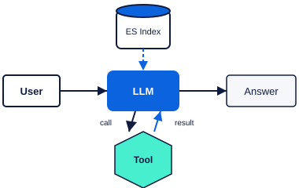
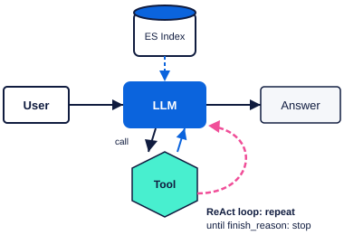

<!-- layout: title -->

Lab 1.3

<h1 class="slide-title">Four versions of Tina. Each one fails at exactly one thing.</h1>

<strong>Tina</strong> is Cortex Bank's AI compliance assistant, the system you build across this module. This track starts from zero: bare LLM call, context from Elasticsearch, a search tool, a ReAct loop.

  &#8592;
  <strong>Tip:</strong> Select <strong>Hide Instructions</strong> in the top bar to give the Brief full width.

---

<!-- layout: problem -->

  

User: What is Cortex Bank's internal
      threshold for filing a Suspicious
      Activity Report when the suspect is
      known, and is a $4,000 suspicious
      transfer by a known customer
      reportable?

Tina: Cortex Bank's internal threshold
      for filing a Suspicious Activity
      Report (SAR) when the suspect is
      known is $5,000. A single $4,000
      suspicious transfer by a known
      customer would generally not meet
      the monetary ...
  

  <h2 class="slide-heading">The problem</h2>
  
Tina answered confidently from her training: $5,000 is the federal figure. She consulted no source. Cortex's own threshold is <strong>$3,500</strong>, in policy-003, so this $4,000 transfer must be reported. Cortex would miss the filing.

  
You will see this yourself in Build 2, stage 1.

---

<!-- layout: concept -->

  

  <h2 class="slide-heading">What a tier is</h2>
  
Four axes: <strong>cost</strong> per 1,000 requests, <strong>latency</strong> p50, <strong>capability</strong> on your task, and <strong>deployment constraints</strong> such as data residency or a limit on completion tokens per reply. A benchmark on the wrong axis picks the wrong tier.

---

<!-- layout: concept -->

  

  <h2 class="slide-heading">Choose by constraint, not by benchmark</h2>
  
Cortex has three possible constraints: a <strong>data-residency</strong> rule, a <strong>cost ceiling</strong> per 1,000 requests, and a <strong>completion-token ceiling</strong> on completion tokens per reply. You will be given one. Residency is a rule; the ceilings are decided by what you measure. Completion tokens include any reasoning a model does before it answers.

---

<!-- layout: concept -->

  

  <h2 class="slide-heading">Stage 1: bare completion</h2>
  
User &rarr; LLM &rarr; answer. No source consulted. The model generates from training weights. Gap: <strong>no source</strong>.

---

<!-- layout: concept -->

  

  <h2 class="slide-heading">Stage 2: context injection</h2>
  
Retrieve top-3 chunks from <code>cortex-policies</code>, inject into the prompt. The model can cite sources. Gap: it can only read what <strong>you pre-loaded</strong>. It cannot request different documents mid-answer.

---

<!-- layout: concept -->

  

  <h2 class="slide-heading">Stage 3: tool calling</h2>
  
Register <code>search_policies(query)</code>. The model calls it on demand. <code>finish_reason: tool_calls</code> triggers your dispatch; the result returns as a <code>role: tool</code> message. Gap: <strong>one shot</strong>. A two-hop question needs two searches.

---

<!-- layout: concept -->

  

  <h2 class="slide-heading">Stage 4: ReAct loop</h2>
  
Handle <code>tool_calls</code>, append each result, continue until <code>finish_reason: stop</code>. The model reasons, searches again, and synthesizes across multiple calls. This is the target architecture.

---

<!-- layout: concept -->

  

# assistant message
{"role": "assistant",
 "tool_calls": [{"id": "call_abc",
   "function": {"name": "search_policies",
     "arguments":
"{\"query\": \"SAR threshold known suspect\"}"
   }}]}

# your dispatch returns:
{"role": "tool", "tool_call_id": "call_abc",
 "content":
   "[{\"policy_id\": \"policy-003\", ...}]"}
  

  <h2 class="slide-heading">The tool-call protocol</h2>
  
Four messages: <strong>assistant</strong> with <code>tool_calls</code>, your code dispatches, a <strong>tool</strong> message with the result, the model continues. You implement the dispatch loop.

---

<!-- layout: concept -->

  

# tool schema
{"name": "search_policies",
 "description": "Search Cortex AML policies",
 "parameters": {"type": "object",
   "properties": {
     "query": {"type": "string"}},
   "required": ["query"]}}

# Elasticsearch query it runs
{"query": {"match": {
  "body_semantic":
    "SAR threshold known suspect"}}}
  

  <h2 class="slide-heading">Your tool is a search</h2>
  
<code>search_policies(query)</code> runs semantic search over <code>cortex-policies</code>. You write the schema and the dispatch. The harness in <code>/opt/ara/lib/tina/</code> handles the LLM loop.

---

<!-- layout: concept -->

  <table class="rule-table" style="font-size:15px;">
    <tr><th>Stage</th><th>What it cannot do</th></tr>
    <tr><td>1: bare completion</td><td>No source consulted</td></tr>
    <tr><td>2: context injection</td><td>Cannot choose documents mid-answer</td></tr>
    <tr><td>3: tool calling</td><td>Cannot loop; one shot only</td></tr>
    <tr><td>4: ReAct loop</td><td>(target; no gap for this task)</td></tr>
  </table>

  <h2 class="slide-heading">What each stage cannot do</h2>
  
The Defend asks which gap applied at each stage. Your recorded trace confirms it.

---

<!-- layout: rule -->
<!-- rule -->

<h2 class="slide-heading">Decision rule</h2>
<table class="rule-table">
  <tr><th>Your constraint</th><th>Choose</th></tr>
  <tr><td>Data residency</td><td>Strong tier: fast has no EU region</td></tr>
  <tr><td>Cost ceiling $0.40 per 1,000</td><td>Under the ceiling; if both or neither, cheaper</td></tr>
  <tr><td>Completion-token ceiling 200 per reply</td><td>Under the ceiling; if both, cheaper; if neither, fewer tokens</td></tr>
  <tr><td>Stage gaps</td><td>What the stage before could not do, per your traces</td></tr>
</table>

Your own measurements decide each row.

---

<!-- layout: done -->

<h2 class="slide-heading" style="color:var(--white);">What done looks like</h2>

  

    5
    runs per tier (Build 1)
  

  

    2
    tool calls in stage 4 both gold values returned
  

  

    4
    stage traces grounded from stage 2
  

---

<!-- layout: next -->

<h2 class="slide-heading">Select Check, then open Build 1</h2>

Environment status:

  

  Provisioning - check back in a moment

